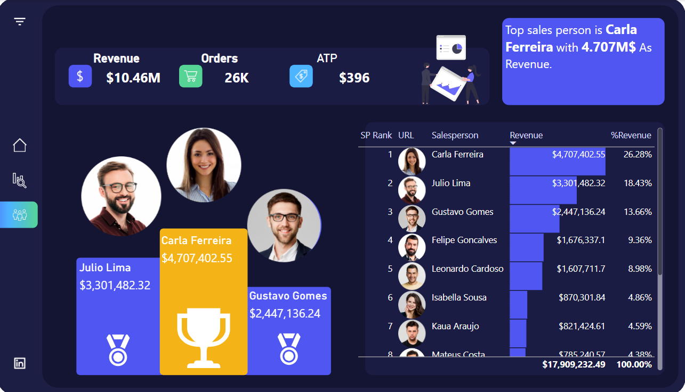

# Revenue Margin Analysis
Appling skills to ivestigate sales and salesperson doing.

## Implemntaion Steps
### Step 1: Importing And Cleaning Data.


### Step 2: Data Modeling and EDA.
Importing your data into Power BI and creating your data model. Once your data is ready, we will start doing some initial exploratory data analysis.

* create a dedicated date table using DAX
  * ``` Date = CALENDARAUTO()  ```
* Creating Measures
  * ```AOP = DIVIDE([Revenue],[Orders])```
  * ```Budget = SUM(Budget[Forecast]) ```
  * ```Orders = DISTINCTCOUNT(Sales[OrderNumber])  ```
  * ```Revenue = SUMX(Sales,Sales[UnitPrice]*Sales[Quantity])  ```
  * ``` Revenue Vs Budget = DIVIDE([Revenue],[Budget] )```
  * ```SP Rank 1 = IF(HASONEVALUE(dsalesperson[Salesperson]),RANKX(ALL(dsalesperson),[Revenue]),BLANK())```


### Step 3: Investigating Sales

* Starting by investigating Revenue over time ,Revenue throught supervisor and salesperson, Revenue by product and channels.
* Creating a tooltip to see each product revenue and average revenue to orders.
* Creating another tooltip to investigate which quarter acheive the target.


### Step 4: Investigating Salesperson Ranking

We ranked salesperson by revenue to find out top 3 salesperson.
  * ```SP Rank 1 = IF(HASONEVALUE(dsalesperson[Salesperson]),RANKX(ALL(dsalesperson),[Revenue]),BLANK())```
  * Creating button to navigate throught pages.



# Final Dashboard Layout


